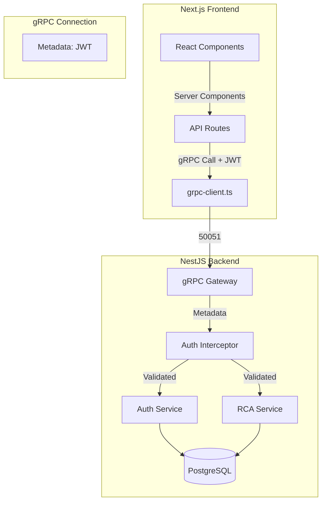

# gRPC Architecture Plan

## Current REST API Surface

### Auth Service (`/auth`)
| Endpoint | Method | Description |
|----------|--------|-------------|
| `/auth/login` | POST | User login (email/password) |
| `/auth/signup` | POST | User registration |
| `/auth/refresh` | POST | Refresh JWT tokens |
| `/auth/logout` | POST | User logout |
| `/auth/forgot-password` | POST | Request password reset |
| `/auth/reset-password` | POST | Reset password |

### RCA Service (`/rcas`)
| Endpoint | Method | Description |
|----------|--------|-------------|
| `/rcas` | GET | List all RCAs for tenant |
| `/rcas` | POST | Create new RCA |
| `/rcas/:id` | GET | Get RCA by ID |

---

## Proposed gRPC Architecture

### 1. Proto Definitions

Create `apps/proto/fixapp.proto`:

```protobuf
syntax = "proto3";

package fixapp;

service AuthService {
  rpc Login(LoginRequest) returns (AuthResponse);
  rpc Signup(SignupRequest) returns (AuthResponse);
  rpc RefreshToken(RefreshRequest) returns (AuthResponse);
  rpc Logout(LogoutRequest) returns (Empty);
}

service RcaService {
  rpc FindAll(FindAllRcasRequest) returns (RcaList);
  rpc FindById(FindByIdRequest) returns (Rca);
  rpc Create(CreateRcaRequest) returns (Rca);
}

// Messages
message LoginRequest {
  string email = 1;
  string password = 2;
}

message SignupRequest {
  string email = 1;
  string password = 2;
  string name = 3;
  string tenantName = 4;
  string subdomain = 5;
}

message AuthResponse {
  string accessToken = 1;
  string refreshToken = 2;
}

message RefreshRequest {
  string refreshToken = 1;
}

message LogoutRequest {
  string accessToken = 1;
}

message Empty {}

message FindAllRcasRequest {
  string tenantId = 1;
  int32 limit = 2;
}

message FindByIdRequest {
  string id = 1;
  string tenantId = 2;
}

message CreateRcaRequest {
  string tenantId = 1;
  string userId = 2;
  string title = 3;
  string description = 4;
  optional string equipmentName = 5;
  optional string maintenanceTicketId = 6;
}

message RcaList {
  repeated Rca rcas = 1;
}

message Rca {
  string id = 1;
  string rcaNumber = 2;
  string title = 3;
  string description = 4;
  string status = 5;
  string tenantId = 6;
  string createdById = 7;
  string createdAt = 8;
  string updatedAt = 9;
}
```

---

### 2. NestJS gRPC Server Setup

**Package Dependencies:**
```bash
npm install @nestjs/microservices grpc grpc-tools @types/grpcd
```

**Backend Module Structure:**

```
apps/backend/src/
├── proto/
│   └── fixapp.proto
├── microservices/
│   ├── grpc-server.module.ts
│   ├── grpc-auth.service.ts
│   └── grpc-rcas.service.ts
└── main.ts (add gRPC server bootstrap)
```

**Key Implementation Points:**
- Create gRPC microservice on port 50051
- Add authentication interceptor to extract JWT from metadata
- Reuse existing services (AuthService, RcasService)

---

### 3. Next.js gRPC Client Integration

**Package Dependencies:**
```bash
npm install grpc @grpc/grpc-js @grpc/proto-loader
```

**Client Setup:**

```typescript
// apps/frontend/src/lib/grpc/client.ts
import * as grpc from '@grpc/grpc-js';
import * as protoLoader from '@grpc/proto-loader';
import { fixappProto } from './types';

const packageDefinition = protoLoader.loadSync(
  path.join(__dirname, '../../../proto/fixapp.proto'),
  { keepCase: false, longs: String, enums: String, defaults: true, oneofs: true }
);

const proto = grpc.loadPackageDefinition(packageDefinition) as fixappProto;

export function createClient(token?: string) {
  const credentials = grpc.credentials.createInsecure();
  const metadata = new grpc.Metadata();
  
  if (token) {
    metadata.add('authorization', `Bearer ${token}`);
  }
  
  return new proto.fixapp.AuthService(
    process.env.NEXT_PUBLIC_GRPC_HOST || 'localhost:50051',
    credentials
  );
}
```

---

### 4. Authentication with gRPC

**Metadata-based Auth:**
```typescript
// Server-side interceptor
@Injectable()
export class GrpcAuthInterceptor implements RpcInterceptor {
  intercept(context: RpcContext, next: () => Observable<any>): Observable<any> {
    const metadata = context.getArgByIndex(1);
    const token = metadata?.['authorization']?.replace('Bearer ', '');
    
    if (!token) {
      throw new RpcException({ code: 16, message: 'Unauthorized' });
    }
    
    // Verify JWT and attach user to context
    // ...
  }
}
```

---

## Migration Strategy

### Phase 1: Dual Protocol (Recommended)
- Keep REST endpoints working
- Add gRPC server alongside HTTP
- Gradually migrate client calls

### Phase 2: Switch Client
- Update `lib/backend-api.ts` to use gRPC
- Test thoroughly
- Remove REST endpoints when confident

---

## Architecture Diagram



---

## Files to Create/Modify

| File | Action |
|------|--------|
| `apps/proto/fixapp.proto` | Create |
| `apps/proto/tsconfig.json` | Create |
| `apps/backend/src/microservices/grpc.module.ts` | Create |
| `apps/backend/src/microservices/auth.grpc.ts` | Create |
| `apps/backend/src/microservices/rcas.grpc.ts` | Create |
| `apps/backend/src/main.ts` | Modify - add gRPC server |
| `apps/frontend/src/lib/grpc/client.ts` | Create |
| `apps/frontend/src/lib/grpc/types.ts` | Create |
| `apps/frontend/src/lib/backend-api.ts` | Modify - use gRPC |

---

## Next Steps

1. **Approve this plan** - Confirm gRPC approach
2. **Generate proto files** - Create TypeScript types from proto
3. **Implement backend** - NestJS gRPC services
4. **Implement frontend** - gRPC client wrapper
5. **Migrate Dashboard** - Update page.tsx to use gRPC
6. **Test** - Verify auth and RCA operations work
